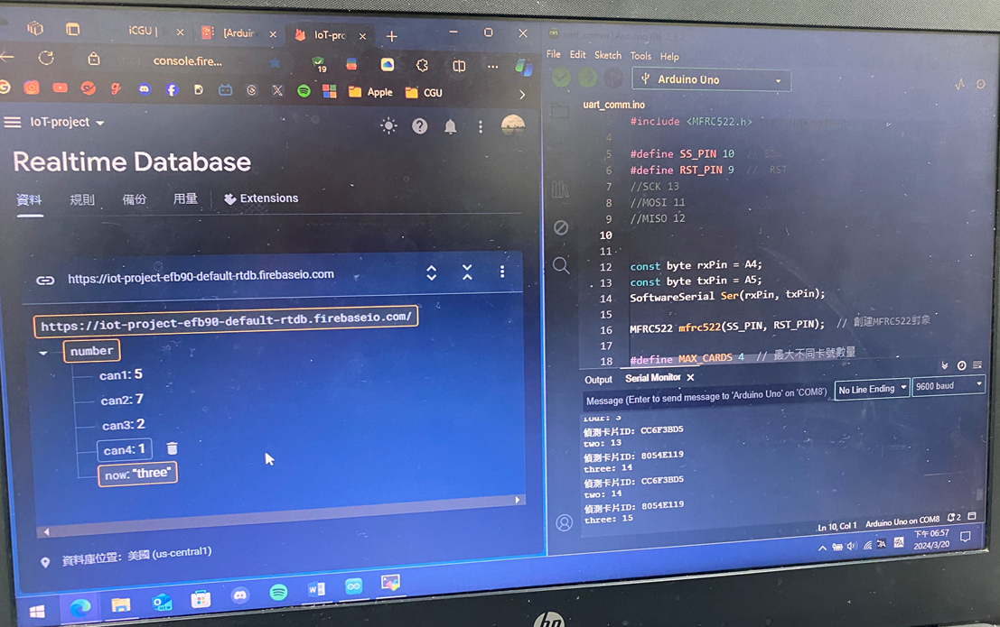
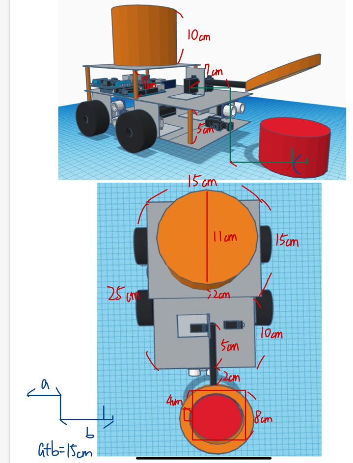

# 智慧垃圾車
- [每週進度](#每週進度)
  - [2024/3/18~2024/3/22(week5)](##2024/3/18~2024/3/22(week5))
    - ### firebase 取得RFID資訊
      
    - ### 車體製作
      
    - ### 夾子改良構想 
        
  - [2024/3/25~2024/3/29(week6)](##2024/3/18~2024/3/22(week6))
    - ### 車體製作
        1. #### 第三層組裝(放車上垃圾桶用)  
        2. #### 車子輪胎調整
        3. #### 超音波感測器擺放位置測試
        
    - ### 壓力感測器測試
         

